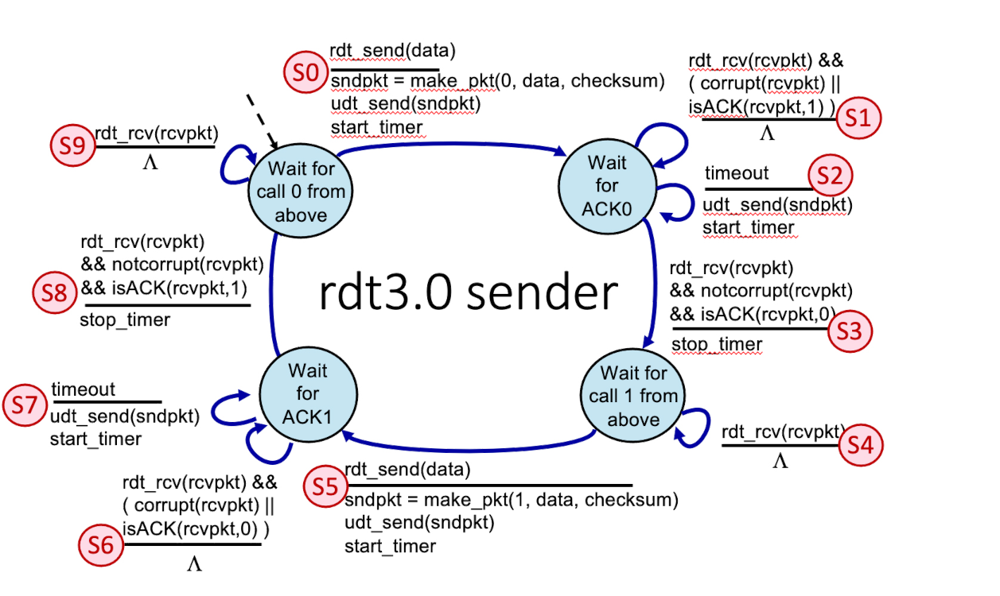
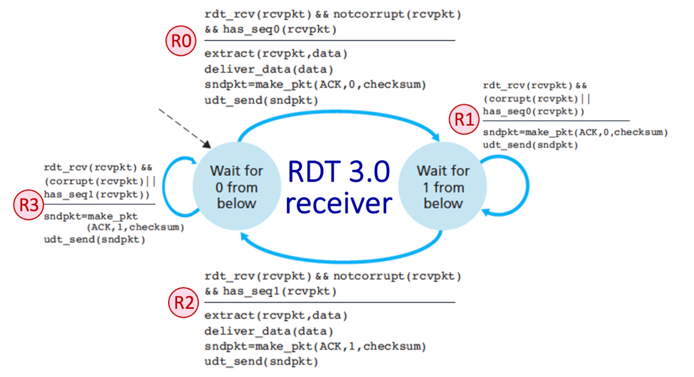

# RDT 3.0 Protocol Implementation in C

An implementation of a Reliable Data Transfer (RDT 3.0) Stop-and-Wait protocol over UDP sockets in C.


## Overview

This project provides a reliable transport layer on top of unreliable UDP. It uses a Stop-and-Wait Finite State Machine (FSM) with alternating sequence numbers (0 and 1), socket-level timeouts for packet loss recovery, and checksum validation for bit-error detection.

## Project Architecture
```
.
├── include/
│   ├── rdt_common.h      # Shared packet structures, macros, and socket declarations
│   ├── rdt_receiver.h    # Receiver interface
│   └── rdt_sender.h      # Sender interface
├── src/
│   ├── main.c            # Application entry point and UDP socket initialization
│   ├── rdt_common.c      # Network I/O, timers, packet construction, and validation
│   ├── rdt_receiver.c    # Receiver state machine logic
│   └── rdt_sender.c      # Sender state machine logic
└── Makefile              # Build congifurations
```

## Finite State Machines



## Packet Structure

Packets are defined by `struct rdt_packet` with a fixed payload capacity of 1024 bytes:

```c
struct rdt_packet {
    unsigned char  seq_num;        // Sequence number (0 or 1)
    unsigned char  ack_num;        // Acknowledgment number (0 or 1)
    unsigned short checksum;       // Packet checksum
    unsigned short payload_size;   // Size of payload data in bytes
    unsigned char  is_last_chunk;  // EOF / terminal packet indicator (1 if last)
    unsigned char  data[1024];     // Payload buffer
};
```

## Key Modules

- `rdt_common`: Handles UDP packet transmission (`udt_send`), blocking reception (`rdt_rcv`), packet generation (`make_packet`), timer configurations (`SO_RCVTIMEO`), and checksum/corruption checks.

- `rdt_sender`: Implements sender FSM states (`WAIT_SEQ_0`, `WAIT_ACK_0`, `WAIT_SEQ_1`, `WAIT_ACK_1`) to transmit file data and retransmit on packet loss or corruption.

- `rdt_receiver`: Implements receiver FSM states (`WAIT_SEQ_0`, `WAIT_SEQ_1`) to accept sequential data, process duplicates, and transmit corresponding ACKs.

- `main`: Parses local port configuration, creates an IPPROTO_UDP socket, and binds it to local_host_addr.

## Build and Usage
Use Makefile
```bash
make
```
Then 
```bash
./bin/app --args
```